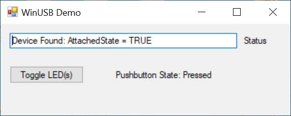
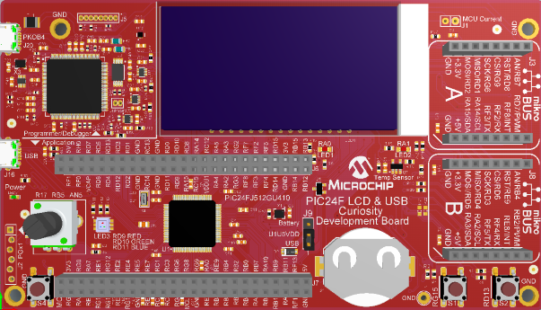

 

# PIC24F LCD USB Curiosity Development Board USB Device Vendor Class Demo.

## Summary

This is the demo software which runs on PIC24F LCD USB Curiosity Development Board (DM240018). The PIC24F LCD USB Curiosity Development Board is a cost-effective, fully integrated development platform targeted at first-time users, Makers, and those seeking a feature-rich rapid prototyping board. Refer to https://www.microchip.com/pic24flcdusbcuriosity for additional details about the board.

## Related Documentation

- PIC24F GU/GL Low Power MCUs: https://www.microchip.com/PIC24F-GU-GL
- PIC24FJ512GU410 microcontroller https://www.microchip.com/PIC24FJ512GU410

## Hardware Used 

- PIC24F LCD USB Curiosity Development Board (https://www.microchip.com/pic24flcdusbcuriosity) 

## Software Used 

- MPLAB® X IDE v5.40 or newer (https://www.microchip.com/mplabx)
- MPLAB® XC16 v1.50 or newer (https://www.microchip.com/xc)

## Operation

This demonstrates basic USB connectivity using a vendor class driver (either WinUSB or LibUSB).

The demo allows the PC application to poll the state of the board push button or change the state of the LED.

After programming(flashing the hex file), plug a USB cable in the second USB port on the board for the application use.  

On Windows 8 or later, no driver installation should be required.  When using on a Windows system before Windows 8, a
signed driver package can be found in the apps/usb/device/vendor_basic/utilities/inf folder.  

On Linux and MacOS systems, no signed driver is required.  LibUSB should be available on those systems for use.

Once connected, open one of the example PC utilities in the utilities folder.  Use the UI elements to read the 
button status and control the LED.  

